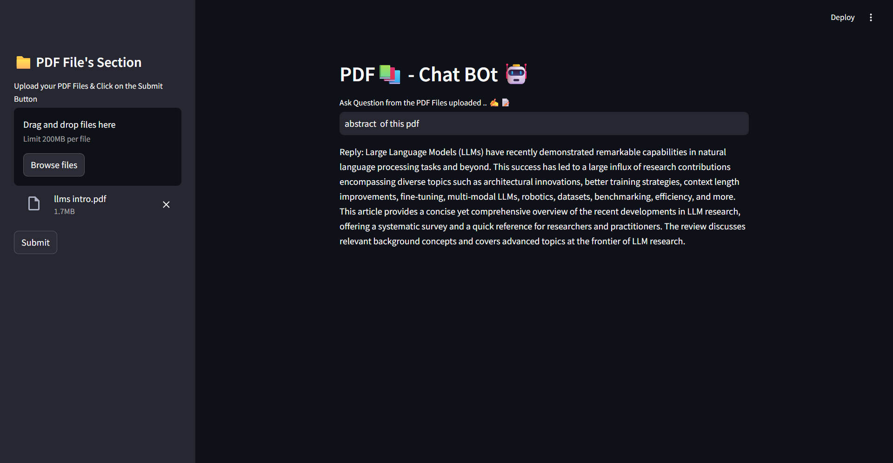

## 📝 Overview
**PDF Chat Bot** is a Streamlit-based web app that enables users to have interactive conversations with a chatbot trained on the contents of uploaded PDF documents. Users can upload multiple PDFs, extract the text, and chat in real time based on the extracted content.

## 🎯 How It Works

The app follows these steps to respond to user queries:

1. **PDF Upload**: Users upload one or more PDF files.
2. **Text Extraction**: The app extracts raw text from each PDF.
3. **Chunking**: The text is split into smaller, manageable sections.
4. **Embedding Generation**: These chunks are converted into vector embeddings using a language model.
5. **Semantic Search**: When a question is asked, the app finds the most relevant chunks using similarity search.
6. **Response Creation**: A response is generated using the selected text chunks and a language model.

## 🌟 Dependencies

- **Streamlit** – For building the web interface.
- **google-generativeai** – Provides the generative AI model for answering queries.
- **python-dotenv** – Loads environment variables (e.g., API keys) from a `.env` file.
- **langchain** – Manages text chunking, embeddings, retrieval, and memory for chatbot conversations.
- **PyPDF2** – Handles PDF reading and text extraction.
- **faiss-cpu** – Performs fast similarity searches using vector embeddings.
- **langchain_google_genai** – Integrates LangChain with Google's generative AI models for embedding and chatting.

## ▶️ Installation Steps

1. Install the dependencies:
   pip install -r requirements.txt

## 📁 Project Structure

pdf-chat-agent/
│
├── app.py # Main Streamlit app file
├── config.py # Configuration settings and environment variables
├── requirements.txt # Python dependencies

## 🖼️ Screenshot

Here’s a preview of the application in action:

---

